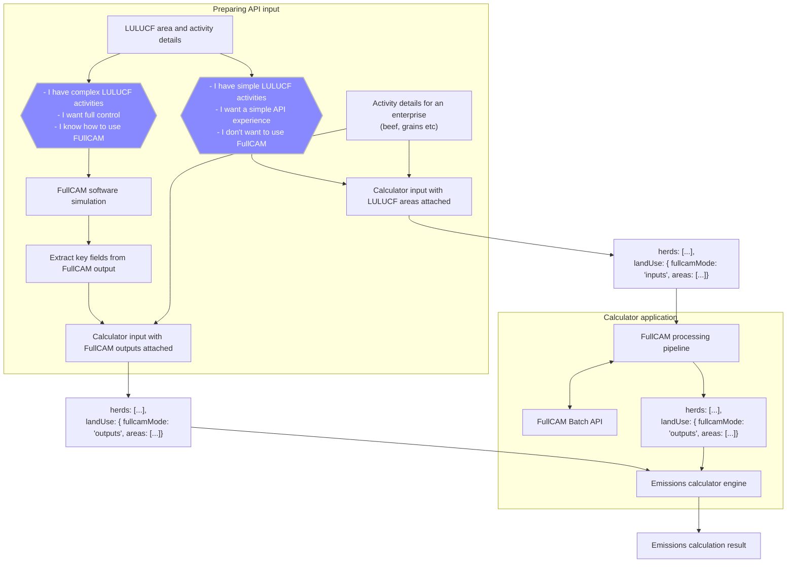

# FullCAM integration

# Data flow

This module for FullCAM implements tools you can use to convert simple event inputs to very specific values needed for the LULUCF chapters in the guidelines. This is achieved by transforming the simple user events and sending them to the FullCAM API to run a simulation. Key values are then extracted out of the simulation results.

There are also types defined that allow the user to run a FUllCAM simulation themselves. They can extract those key values themselves and supply them directly to the emissions calculators, along with the other inputs needed to describe their farming activity.

The tools are designed to provide a reliable toolkit for upgrading simple inputs to valid FullCAM outputs. This can be used by an application that is integrating with the emissions calculators. This integration has been implemented by the AIA emissions calculator REST API.

## Input handling

1. The user decides if they want to use FullCAM directly, or they want to supply their land use events in a simple format
2. An application can check whether the user has supplied the outputs from FullCAM, or the simple events that must be upgraded
3. If the user has specified the `landUse` input in the schema expected by the emissions-calculator package, the calculation request can simply be forwarded on to the package
4. If the user has specified the simpler `landUse` input designed for FullCAM submission, those inputs need to be passed on to the FullCAM processing tools

## FullCAM processing

1. A valid plot file needs to be prepared for submitting to the FullCAM batch API
2. The template plot file needs to be updated with all events specified by the user
3. The template also needs to have species extracted from all events and injected as `SpeciesForest` records
4. The valid FullCAM plotfile, with all of their simple inputs injected, can be submitted to the batch API for processing

## Result handling

1. The key attributes are extracted from the simulation result, which is a CSV made up of monthly line items
2. The original `landUse` inputs are merged with the simulation results to generate a valid `landUse` key that the calculators package can accept
3. The original full calculator input is updated with that new `landUse` content, and the emissions calculation is performed
4. The full response is returned to the user

# JavaScript API

```typescript
import { calculateEmissions } from '@aginnovationaustralia/emissions-calculators'
import {
    isLandUseFullCAMOutputs,
    FullCAMInputs,
    FullCAMOutputs,
    GrainsInputWithFullCAMSchema,
    GrainsInputWithFullCAM,
    generateTemplateForSpatialUpdate
} from '@aginnovationaustralia/emissions-calculators/fullcam'

function processLandUseKey(landUse: FullCAMInputs | FullCAMOutputs): FullCAMOutputs {
    if (isLandUseFullCAMOutputs(landUse)) {
        return landUse
    }

    const plotFiles = landUse.areas.map((area) => ({
        areaKey: uniqueHash(area),
        plotContent: generateTemplateForSpatialUpdate(area)
    })

    const batchOptions: RunSimulationBatchOptions = {
        fullcamWorkflowApiKey: 'abcd1234',
        notificationEmail: 'myaddress@example.com'
    }

    const simulationResults = runSimulationBatch(plotFiles, options)


}

const userInput: unknown = {
    crops: [...],
    landUse: {
        fullcamMode: 'inputs',
        areas: [{
            latitude: -37.756414,
            longitude: 145.081546,
            region: 'Victorian Midlands',
            ...
            plantingEvents: [{
                plantingDate: new Date('2023-01-01'),
                speciesName: 'Environmental Plantings'
            }],
        }]
    }
}

const parseResult = GrainsInputWithFullCAMSchema.safeParse(userInput)

if (!parseResult.success) {
    throw new Error('The user input is not valid')
}

const validInput = userInput as GrainsInputWithFullCAM

const initialLandUse = calculatorRequest.landUse

const landUse = processLandUseKey(initialLandUse)

const inputForCalculation = {
    ...validInput,
    landUse
}

const emissions = calculateEmissions('grains', inputForCalculation)

```

# Caching and optimisation

The tools here help to define expected input and output values, and some templates that are used to generate valid requests. There is no code path out of the box that will make the API requests for you. It is necessary to supply your FullCAM API key, and to call the API responsibly. This means things like caching of results to reduce the load placed on the FullCAM APIs.

# Status

For now, this code should be considered a working prototype.

# Example application


